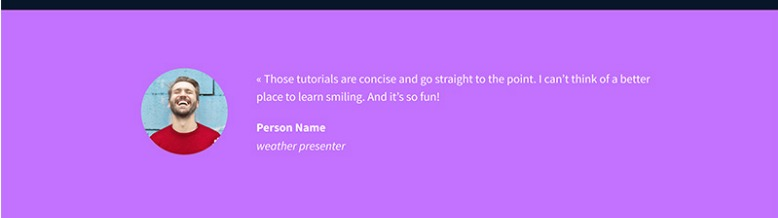
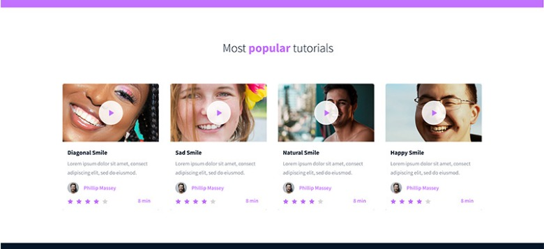
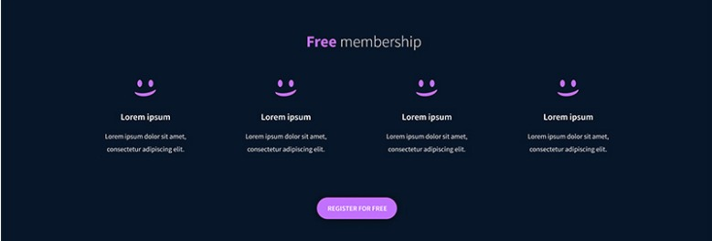
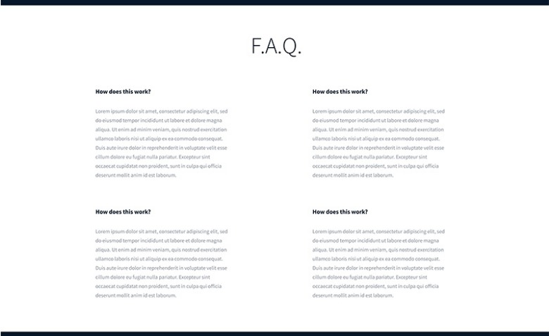
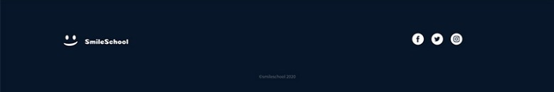

# Smile School Website (CSS Advanced)

This "CSS, advanced" project is part of my ALX Intro to SE curriculum, where I've implemented advanced styling for the "Smile School" website. The focus of this project was to apply CSS styling to the existing HTML structure, creating an appealing and responsive design based on the [provided Figma design](https://www.figma.com/file/dyYL6Ku4WG7vsdpwvlcJZC/Homepage).

VIEW LIVE: [https://jimike.netlify.app/smile](https://jimike.netlify.app/smile/)

## Table of Contents

- [Description](#description)
- [Features](#features)
- [Screenshots](#screenshots)
- [Technologies Used](#technologies-used)
- [Setup and Usage](#setup-and-usage)
- [Contributing](#contributing)
- [License](#license)
- [Contact](#contact)

## Description

In this project, I've applied advanced CSS techniques to style the "Smile School" website. The objective was to create a visually appealing design that is consistent with the [provided Figma design](https://www.figma.com/file/dyYL6Ku4WG7vsdpwvlcJZC/Homepage), making the website responsive and user-friendly across various devices.

## Features

- Advanced CSS techniques such as flexbox and grid layout for responsive design.
- Carefully crafted styles for the Header, Banner, Quote, Videos, Membership, FAQ, and Footer sections.
- Responsive design that ensures optimal user experience on different screen sizes.

## Screenshots

## Technologies Used

- HTML
- CSS (Advanced)

## Setup and Usage

1. Clone this repository to your local machine.
2. Open the `index.html` file in a web browser to view the styled website.

## Contributing

This project is a part of my ALX Intro to SE Program. While contributions are not actively sought at this time, if you have suggestions or improvements related to the CSS styles, feel free to open an issue or pull request.

## License

This project is licensed under the [MIT License](https://mit-license.org).

## Contact

For any inquiries or questions, feel free to contact me:

- Name: Michael Oladoye
- Email: [email me](mailto:oladoyemike@gmail.com)
- LinkedIn: [Michael Oladoye](https://www.linkedin.com/in/jimike/)
- X (formerly Twitter): [@jimikeCodes](https://twitter.com/jimikeCodes)
