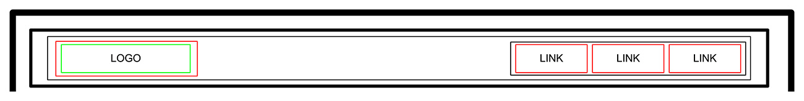

# Smile School Homepage (HTML Only)

This "HTML, advanced" project is part of my ALX Intro to SE curriculum, where I've implemented the HTML structure for a homepage called "Smile School." The focus of this project was to create a semantically structured HTML layout for the webpage, based on the [provided Figma design](https://www.figma.com/file/dyYL6Ku4WG7vsdpwvlcJZC/Homepage).

## Table of Contents

- [Description](#description)
- [Project Structure](#project-structure)
- [Wireframes](#wireframes)
- [Technologies Used](#technologies-used)
- [Setup and Usage](#setup-and-usage)
- [Contributing](#contributing)
- [License](#license)
- [Contact](#contact)

## Description

In this project, I've crafted the HTML structure for the "Smile School" homepage. The objective was to create semantically meaningful HTML elements to accurately represent the different sections of the web page as per the [provided Figma design](https://www.figma.com/file/dyYL6Ku4WG7vsdpwvlcJZC/Homepage).

## Project Structure

The project's HTML structure is organized as follows:

- `index.html`: The main HTML file containing the structure of the page.

## Wireframes

The following wireframes were provided to guide the project:

`Header | Banner | Quote | Videos | Membership | FAQ | Footer`

## Technologies Used

- HTML

## Setup and Usage

1. Clone this repository to your local machine.
2. Open the `index.html` file in a text editor or browser to view the HTML structure.

## Contributing

This project is a part of my ALX Intro to SE program, and I'm not actively seeking contributions at this time. However, if you have suggestions or improvements related to the HTML structure, feel free to open an issue or pull request.

## License

This project is licensed under the [MIT License](https://mit-license.org/).

## Contact

For any inquiries or questions, feel free to contact me:

- Name: Michael Oladoye
- Email: [email me](mailto:oladoyemike@gmail.com)
- LinkedIn: [Michael Oladoye](https://www.linkedin.com/in/jimike/)
- X (formerly Twitter): [@jimikeCodes](https://twitter.com/jimikeCodes)
